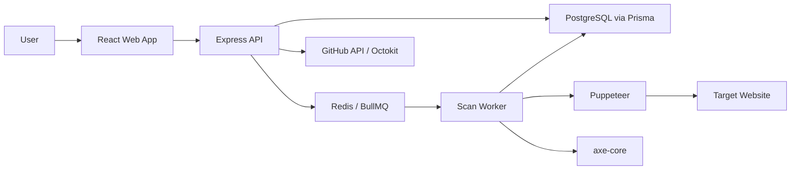

# Architecture

A11yFix is a pnpm workspace with three primary packages:

```txt
apps/api              Express backend
apps/web              React frontend
packages/shared-types Shared TypeScript types
```

## System Flow



## Backend

The backend is an Express 4 application. It owns:

- Site creation
- Scan creation
- Scan status polling
- Violation retrieval
- Fix generation
- GitHub OAuth
- GitHub repository linking
- Pull request automation

Important folders:

```txt
apps/api/src/routes       HTTP route handlers
apps/api/src/services     crawler, scanner, prioritizer, fix generator, GitHub PR logic
apps/api/src/jobs         BullMQ queue and scan worker
apps/api/src/security     URL validation and token encryption
apps/api/src/db           Prisma schema and client
```

## Frontend

The frontend is a Vite React app with TanStack Query for server state.

Important pages:

- `Dashboard`: lists sites and recent scan summaries.
- `NewScan`: accepts a public URL and starts a scan.
- `ScanDetail`: polls scan status and displays sorted violations.

## Data Store

PostgreSQL stores:

- Users
- Sites
- Scans
- Scanned pages
- Violations
- Suggested fixes
- PR URLs

Redis stores scan jobs through BullMQ. It does not store durable audit results.

## Worker Model

The scan pipeline is intentionally asynchronous:

1. User creates a scan.
2. API stores the scan with `QUEUED` status.
3. API enqueues a BullMQ job.
4. Worker crawls pages with Puppeteer.
5. Worker runs axe-core on each rendered page.
6. Worker computes priority scores.
7. Worker persists violations and marks scan `COMPLETED`.

This prevents slow browser work from blocking normal HTTP requests.
